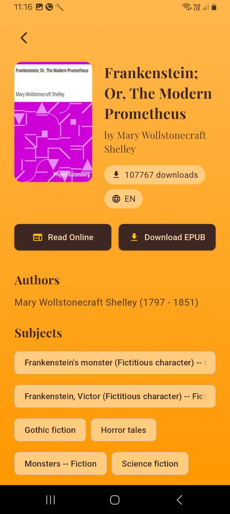
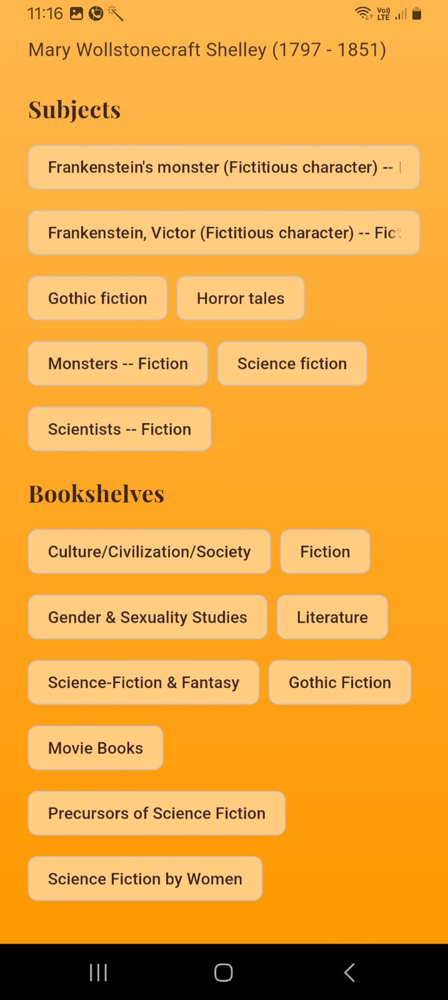
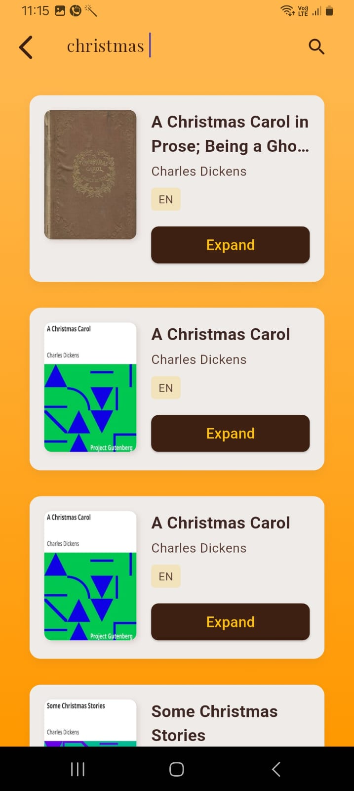

# BookHive 

A beautifully crafted Flutter application that brings the warmth of traditional libraries to your digital device. BookHive provides free access to classic literature through an elegantly designed interface, combining vintage aesthetics with modern functionality.

---

## Features

- **Collection of Books**: Browse extensive collection of classic literature, fetched by free books api - https://gutendex.com/
- **Categorization of Books**: Categorization based upon language, title and author.
- **Book Details**: View detailed information about a book, including title, author, language, downloads, subjects and bookshelves.
- **Search**: Seamless searching among the collection of books by using the search option on the app bar.
- **Pagination**: Implemented pagination to request data in chunks and on appropriate triggers.
- **UI**: Developed a warm UI which is based upon library and rustic themes, by incorporating colors such as brown and amber.
- **Download**: Implemented features to download epub and text files from the browser.
---

## Technology Stack

- **Flutter**: Frontend framework for building cross-platform applications.
- **BLoC**: State management architecture to keep logic and UI seperated for better debugging and increase code readablity.
- **Dio**: HTTP client for API integration.
- **Material Design**: Provides a consistent UI/UX across the app.
- **URL Launcher**: Provides the functionality for downloading resources such as files from the internet.
- **Go Router**: For efficient Navigation across app screens and to pass on props.

---

## Architecture

The app follows the **BLoC Architecture**, ensuring separation of concerns and a clean code structure:

- **Presentation Layer**: Contains widgets and UI components (e.g.,Splash Page, HomePage, SearchPage, BookDetailsPage).
- **Business Logic Layer**: Managed by BLoC classes that handle events and emit states.
- **Data Layer**: Contains models and services to fetch and process data.

---

## Design 
- Warm amber/orange theme reminiscent of aged paper
- Elegant off-white cards with subtle shadows
- Clean Playfair Display for content for vintage look
- Widgets such as Clip Rect, Sections, Expanded etc
- Clear visual hierarchy

---

## Prerequisites

- **Flutter**: Version 3.x or later.
- **Dart**: Version 2.19 or later.
- **Android/iOS Emulator or Device**: For testing.
- **ENV**: For url.

---

## Installation Instructions

1. Clone the repository:
   ```bash
   git clone https://github.com/DeenankSharma/books_app.git
   cd untitled1
   ```

2. Install dependencies:
   ```bash
   flutter pub get
   ```

3. Run the app on an emulator or connected device:
   ```bash
   flutter run
   ```

---

## File Structure

```
lib/
├── data/
│   ├── models/            # Data models (e.g., BookModel and Author Model)
│   └── services/          # API integration services such as Fetching and Searching Books
├── features/              # features such as home, search etc
│   ├── details/           
|   ├── home/
|       ├── ui/            # UI - screens and components
|       ├── bloc/          # BLoC files for state management
│   ├── search/          
│   ├── splash/           
└── main.dart              # App entry point
└── routes.dart            # App routes and navigation management
```

## Usage Instructions

1. Launch the app on your device or emulator.
2. After the loading screen, books are fetched and home screen is laoded.
3. Then on further scrolling, more books from the collection will be loaded.
4. Click on the details button on a book to view detailed information.
5. In the Search page:
   - Type in the search bar to find books.
   - Click on the details button on a book to view detailed information.
---

## Screenshots

### Home Page


### Book Details Page


### Book Details Page - 2


### Search Page


### Search Result


